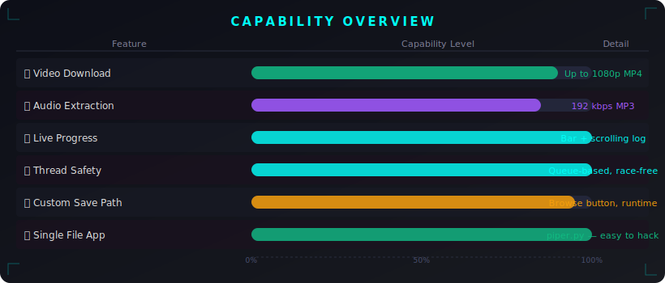
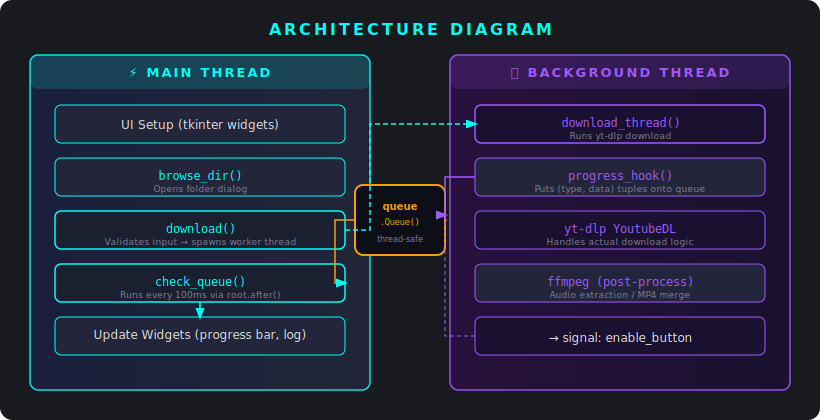
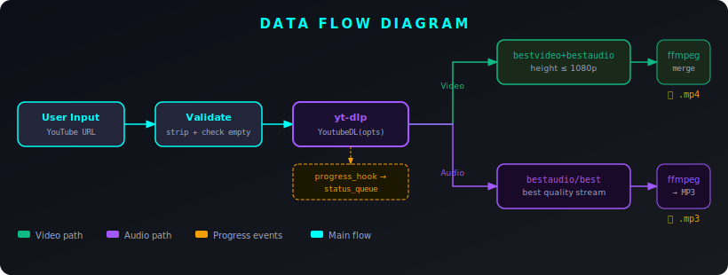
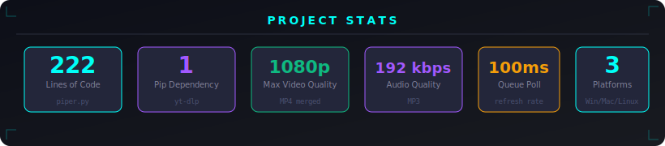

<p align="center">
  
</p>

<p align="center">
  <b>It's a pipe. It downloads YouTube things. That's… basically it. But it does it <em>really</em> cleanly.</b>
</p>

<p align="center">
  <a href="#-features">Features</a> •
  <a href="#-installation">Installation</a> •
  <a href="#-usage">Usage</a> •
  <a href="#-architecture">Architecture</a> •
  <a href="#-roadmap">Roadmap</a> •
  <a href="#-license">License</a>
</p>

---

> You ever just want to download a video without selling your soul to some sketchy `.exe` or typing 40 flags into yt-dlp by hand at 1am? Yeah. That's why Piper exists.

**Piper** is a desktop GUI for downloading YouTube videos and audio. Built on Python's `tkinter` (the one that ships with Python — no extra packages), powered by [yt-dlp](https://github.com/yt-dlp/yt-dlp) under the hood, and styled with a neon dark theme that will make your friends think you're hacking something important.

---

## 🏅 Badges

<p align="left">
  
  
  
  
  
  
  
  
</p>

---

## 🎬 In Action

> _A picture is worth a thousand words. A GIF is worth a thousand pictures._


**📌 No GIF yet?** Place your demo recording here: `assets/demo.gif`

The GIF should show:
- Pasting a YouTube URL into the input field
- Selecting Video or Audio mode
- Clicking Download and watching the progress bar fill up
- The log scrolling with percentage output
- File appearing in the save folder

Keep it short — 10–15 seconds of terminal/GUI magic, loop-friendly.

---

## 🧠 System Overview

Piper is a **single-file desktop application** (`piper.py`) — no web server, no database, no cloud, no telemetry. Just a Python window talking to `yt-dlp` talking to YouTube. All files go exactly where you tell them.

```
piper.py              # ~222 lines — the entire app
requirements.txt      # one line: yt-dlp
piper.spec            # PyInstaller config for standalone .exe
```

Downloads run in a **background thread** so the GUI doesn't freeze mid-download (looking at you, every 2010 GUI tutorial that just calls `requests.get()` on the main thread). Progress events are relayed through a thread-safe queue back to the UI — because race conditions are not the vibe.

---

## ✨ Features

| Feature | What it actually does |
|---------|----------------------|
| 🎬 **Video Download** | Downloads video + audio streams, merges into `.mp4` (up to 1080p) |
| 🎵 **Audio Extraction** | Grabs the best audio stream, converts to 192 kbps `.mp3` |
| 📊 **Live Progress** | Real-time progress bar + scrolling log with percentage readout |
| 📁 **Custom Save Path** | Browse button to pick any folder; defaults to `~/Downloads` |
| 🎨 **Neon Dark UI** | Cyan/purple theme via `ttk.Style`, no external theme packages |
| 🔒 **Thread-Safe** | All tkinter writes happen on the main thread via `queue.Queue` |
| 📦 **Single File** | One `.py` file. Easy to read, fork, and understand over coffee |
| 🖥️ **Cross-Platform** | Works on Windows, macOS, and Linux wherever tkinter runs |

---

## 📡 Capability Visualization

<p align="center">
  
</p>

---

## 🏗️ Architecture

<p align="center">
  
</p>

The architecture is deliberately minimal. There are two "threads":

1. **Main Thread** — owns all tkinter widgets. Handles input, spawns the worker, and drains the queue every 100ms with `root.after()`.
2. **Background Thread** — runs the yt-dlp download. Never touches a widget directly. Instead, it posts `(type, data)` tuples onto a `queue.Queue`.

This separation exists because tkinter is *emphatically* not thread-safe. The architecture enforces this hard boundary so you don't end up with mysterious crashes at 47% download.

---

## 🌊 Data Flow

<p align="center">
  
</p>

**The short version:**

```
YouTube URL
    ↓  (validated on main thread)
yt-dlp download (background thread)
    ├── Video mode → bestvideo+bestaudio → ffmpeg merge → .mp4
    └── Audio mode → bestaudio → ffmpeg → .mp3 @ 192kbps
```

Progress events flow back via `status_queue` → `check_queue()` → GUI updates.

---

## 🚀 Installation

### 1 — Clone

```bash
git clone https://github.com/Kaelith69/piper.git
cd piper
```

### 2 — Install Python dependencies

```bash
pip install -r requirements.txt
```

That's literally one package (`yt-dlp`). You're welcome.

### 3 — Install ffmpeg

| Platform | Command |
|----------|---------|
| **Windows** | Download from [ffmpeg.org](https://ffmpeg.org/download.html), extract, add `bin/` to `PATH` |
| **macOS** | `brew install ffmpeg` |
| **Ubuntu/Debian** | `sudo apt install ffmpeg` |
| **Fedora** | `sudo dnf install ffmpeg` |

> **Why ffmpeg?** yt-dlp downloads video and audio as separate streams (because YouTube serves them that way). ffmpeg merges them. For audio-only, ffmpeg handles the MP3 conversion. Without it, video downloads would be silent and audio wouldn't be MP3. So yeah, install ffmpeg.

### 4 — Run

```bash
python piper.py
```

A window appears. You're done.

---

## 🎮 Usage

1. **Paste** a YouTube URL into the field. Full URL — `https://www.youtube.com/watch?v=...`
2. **Pick** a mode:
   - **Video (1080p)** — merges best video + audio into `.mp4`
   - **Audio (High Quality MP3)** — extracts audio, converts to `.mp3`
3. *(Optional)* Click **Browse…** to change the save folder
4. Hit **Download** and watch the progress bar do its thing
5. File lands in your chosen folder as `<Title>-<VideoID>-video.mp4` or `<Title>-<VideoID>-audio.mp3`

> **Pro tip:** The download button disables itself while downloading so you can't accidentally start 17 parallel downloads. It re-enables when done. You're welcome, past self.

---

## 📂 Project Structure

```
piper/
├── piper.py            # 🧠 The whole app (222 lines)
├── piper.spec          # 📦 PyInstaller packaging config
├── requirements.txt    # 📋 Dependencies (just yt-dlp)
├── banner.svg          # 🎨 Original project banner
├── assets/
│   ├── hero-banner.svg     # README hero
│   ├── architecture.svg    # Thread model diagram
│   ├── data-flow.svg       # Pipeline diagram
│   ├── capabilities.svg    # Feature visualization
│   ├── stats.svg           # Project stats panel
│   └── demo.gif            # ← place your demo here
├── wiki/
│   ├── Home.md
│   ├── Architecture.md
│   ├── Installation.md
│   ├── Usage.md
│   ├── Privacy.md
│   ├── Troubleshooting.md
│   └── Roadmap.md
└── .gitignore
```

---

## 📊 Performance Stats

<p align="center">
  
</p>

---

## 🔏 Privacy

**Piper collects nothing.** Zero. Null. `None`.

- No analytics
- No crash reporting
- No network calls except the yt-dlp download you initiate
- No account, no login, no API keys
- Files go to your local filesystem and nowhere else

yt-dlp itself is open source. You can verify exactly what network requests are made. The only external communication is yt-dlp talking to YouTube servers — the same communication your browser makes when you watch the video.

See [wiki/Privacy.md](wiki/Privacy.md) for more detail.

---

## 🔭 Roadmap

Things that *might* happen when motivation and free time align:

- [ ] **Playlist support** — batch download entire playlists
- [ ] **Format selector** — choose from available resolutions (720p, 480p, etc.)
- [ ] **Download queue** — queue multiple URLs at once
- [ ] **Dark/light theme toggle** — for the brave souls who use light mode
- [ ] **Windows `.exe` release** — proper packaged binary via GitHub Actions
- [ ] **macOS `.app` bundle** — for the Apple crowd
- [ ] **Subtitle download** — `.srt` alongside video
- [ ] **Speed limiter** — for when you're on a shared connection
- [ ] **Thumbnail preview** — show video thumbnail before downloading

See [wiki/Roadmap.md](wiki/Roadmap.md) for the full list and status.

---

## 📦 Packaging as Standalone Executable

```powershell
pip install pyinstaller
pyinstaller --onefile --noconsole piper.py
```

Output lands in `dist/piper.exe`. Distribute that file.

> **Note:** Recipients still need ffmpeg in their PATH for audio and video merge to work. There's no clean way to bundle ffmpeg inside the exe due to licensing and file size.

---

## 🤝 Contributing

PRs welcome. See [CONTRIBUTING.md](CONTRIBUTING.md) for how to get involved without causing chaos.

---

## 🔐 Security

Found a vulnerability? See [SECURITY.md](SECURITY.md) for responsible disclosure.

---

## 📜 License

MIT. See [LICENSE](LICENSE) for the boring legal text.

Built by [Kaelith69](https://github.com/Kaelith69). Use it, fork it, break it, improve it.
